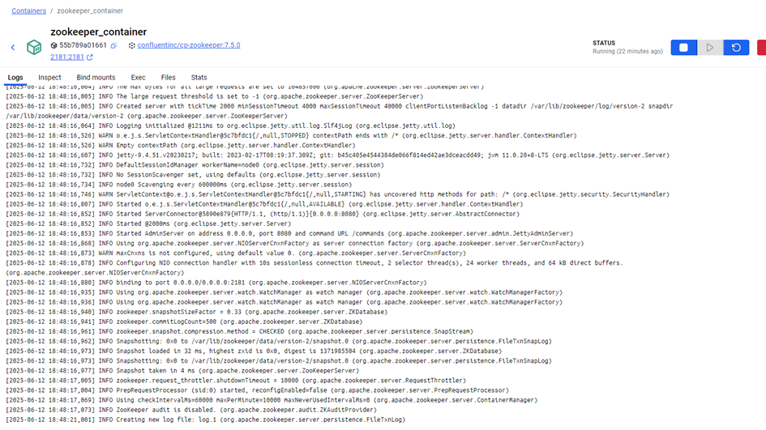
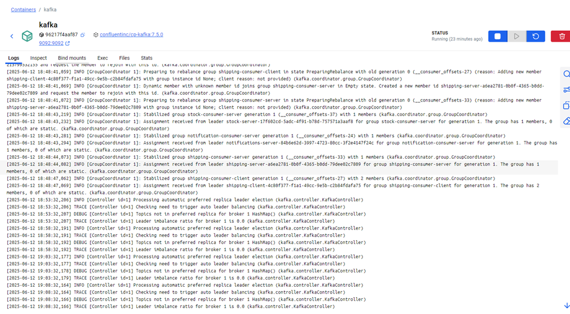
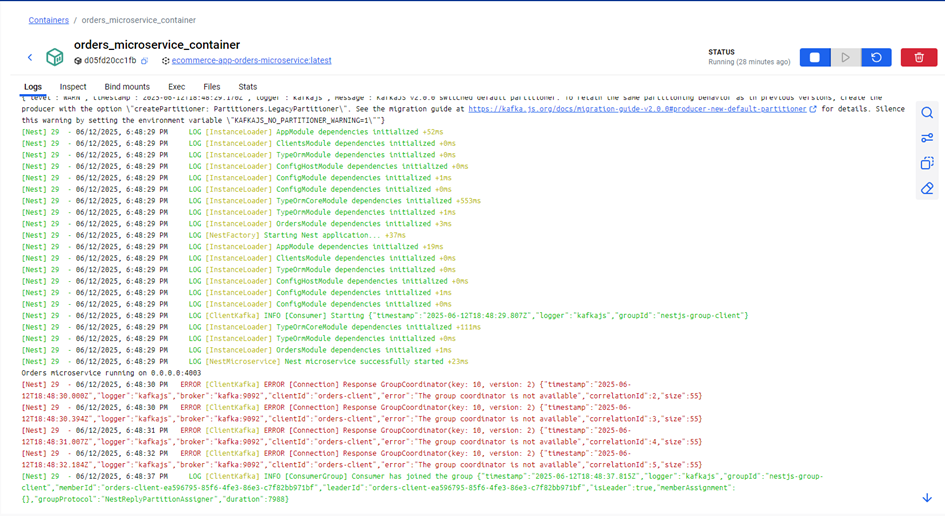

# Ecommerce-app

This project is final case of the **NewMindAi Bootcamp**. It was built using **NestJS**, follows **modular, clean code principles**, and adopts a **microservice architecture** with **Kafka**, **PostgreSQL**, **MongoDB**, **Redis**, and **Docker**. The application is fully containerized and includes services such as **Users**, **Products**, **Orders**, **Cart**, **Shipping**, **Stock**, **Notifications**, **Authentication**, and **API Gateway**.

## 🚀 Features

- Built with **NestJS** and **TypeScript**
- Microservices Architecture with **Kafka** as message broker
- CRUD operations for **Users**, **Products**, **Orders**, **Cart**
- **MongoDB** for Cart and Shipping services, **PostgreSQL** for others
- **Redis Cache** integration for performance optimization
- **DTO validation** with `class-validator`
- **Guards** for Admin and Super Admin role access
- **Pipes** for data validation and transformation
- **Global Exception Filter** for standardizing error responses
- **Interceptors** for consistent success response structure
- **Swagger Documentation** 
- Implements **Atomic Commits** with **Semantic Commit Messages**

## 🔧 Installation

```bash
# Install dependencies
npm install

# Run full system with Docker
docker-compose up --build
```

> Make sure you have Docker, Docker Compose and Node.js installed.

## 🔗 Sample Endpoints
- **Users Service:** `/users` → List of users

- **Products Service:** `/products` → List of products

- **Products Service:** `/products/:id` → Get a specific product by ID

- **Users Service:** `/users/:id` → Get a specific user by ID

- **Users Service:** `/users` → Create a new user

- **Products Service:** `/products` → Add a new product

- **Users Service:** `/users/:id` → Update user details (including role update, Super Admin only)

## 📆 Shared Library

This project uses a **Shared Library (`libs`)** to centralize and reuse common logic, types, and patterns across all microservices. This promotes **DRY principles**, consistency, and maintainability.

### 📂 What’s included?
- `DTO` classes shared across services (e.g., `CreateUserDto`, `CreateProductDto`)
- `Types` and interfaces (e.g., `PaginationParams`, `SortOrder`)
- Kafka `Event Patterns` used in inter-service communication
- Shared enums and utility types

### 🔗 Example Usage
```ts
// In any microservice
import { CreateUserDto, USER_PATTERNS } from '@ecommerce/types';
```

### 🔧 Benefits
- Centralized schema validation
- Improved type safety and reusability
- Clean versioning and atomic updates
- Decouples logic across microservices

## 📸 Screenshots

## 🐳 Docker Containers Overview

The system runs all services and dependencies in isolated containers using Docker Compose:


### 🗄️ Databases & Infrastructure

- PostgreSQL – Orders Microservice  
  
- Redis Cache  
  
- MongoDB – Cart and Shipping  
    
  
- pgAdmin Interface  
  
- Zookeeper & Kafka Services  
    
  

### 🧩 Microservices

- API Gateway  
  
- Auth Service  
  
- Cart Service  
  
- Notifications Service  
  
- Orders Service  
  
- Products Service  
  
- Shipping Service  
  
- Stock Service  
  
- Users Service  
  

> Full visual overview available in: [Screenshots.pdf](./assets/screenshots/Screenshots.pdf)

## 📘 Swagger UI


##  Commit Strategy

This project follows:

- **Atomic Commits**  
  Each commit introduces a single, meaningful change.

- **Semantic Commit Messages**  
  Examples:
  - `feat: add /oldestEmployee API endpoint`
  - `refactor: modularize API route handling`
  - `fix: handle invalid JSON gracefully`

> This strategy improves collaboration, code review, and readability of the project history.
## Contact

<table style="border-collapse: collapse; width: 100%;">
  <tr>
    <td style="padding-right: 10px;">Bengisu Şahin - <a href="mailto:bengisusaahin@gmail.com">bengisusaahin@gmail.com</a></td>
    <td>
      <a href="https://www.linkedin.com/in/bengisu-sahin/" target="_blank">
        
      </a>
    </td>
  </tr>
</table>